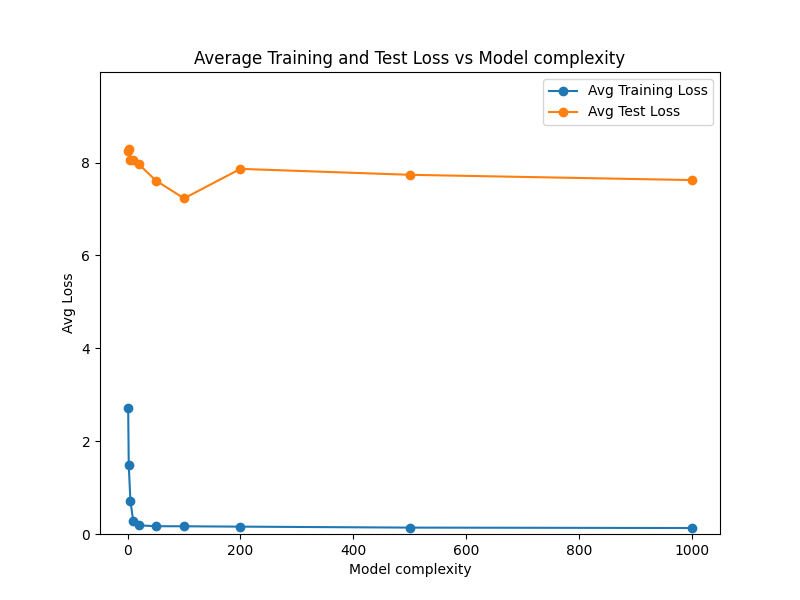

**Double Descent Phenomenon Demonstration**

This project demonstrates the double descent phenomenon using a simple regression model with 500 samples and 1000 features.

*Instructions to Run the Project*

1. Clone the repository using:
```
bash
git clone https://github.com/ChisengaSol/double-descent.git
```
1. Navigate to the source directory:
```
bash
cd double-descent
```
1. Ensure that Python is installed on your machine.
2. Create a virtual environment using:
```
shell
python -m venv double_descent_venv
```
1. Activate the virtual environment using:
```
bash
source double_descent_venv/bin/activate
```
1. Install the dependencies using:
```
shell
pip install -r requirements.txt
```
1. Run the main file using:
```
shell
python main.py
```

*Results*




Note: The result.png file will be generated after running the main.py file.

*Description*

This project demonstrates the double descent phenomenon, where the model's performance improves as the capacity of the model increases, but then deteriorates as the capacity exceeds a certain threshold. The project uses a simple regression model with 500 samples and 1000 features to illustrate this phenomenon.
